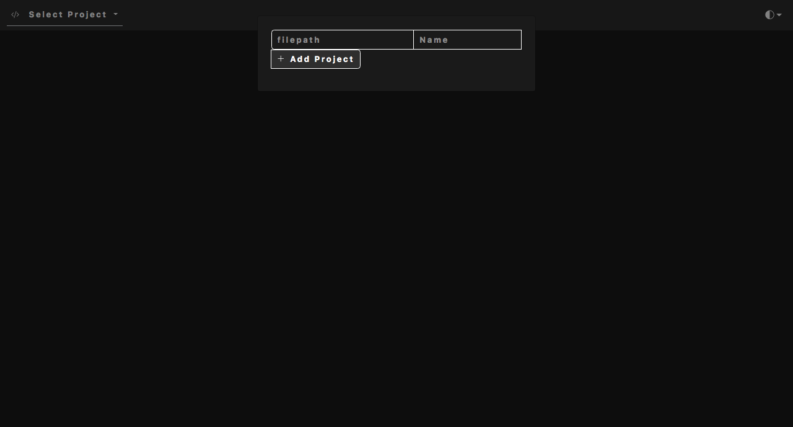
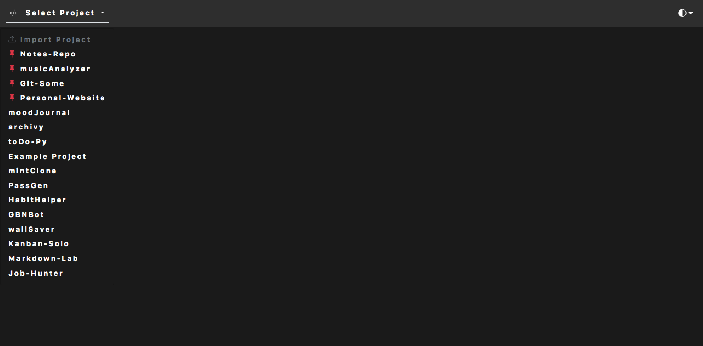
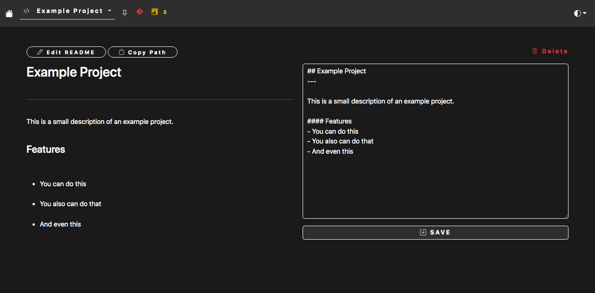
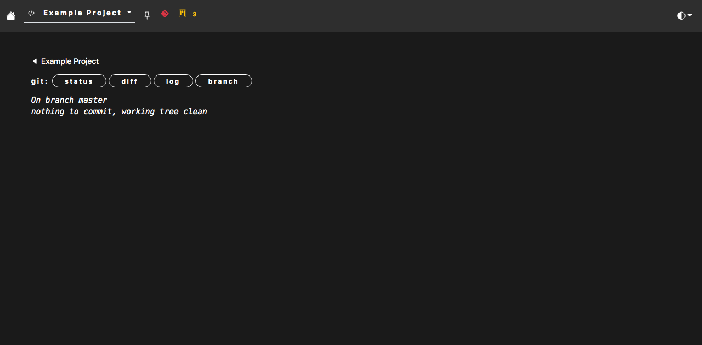
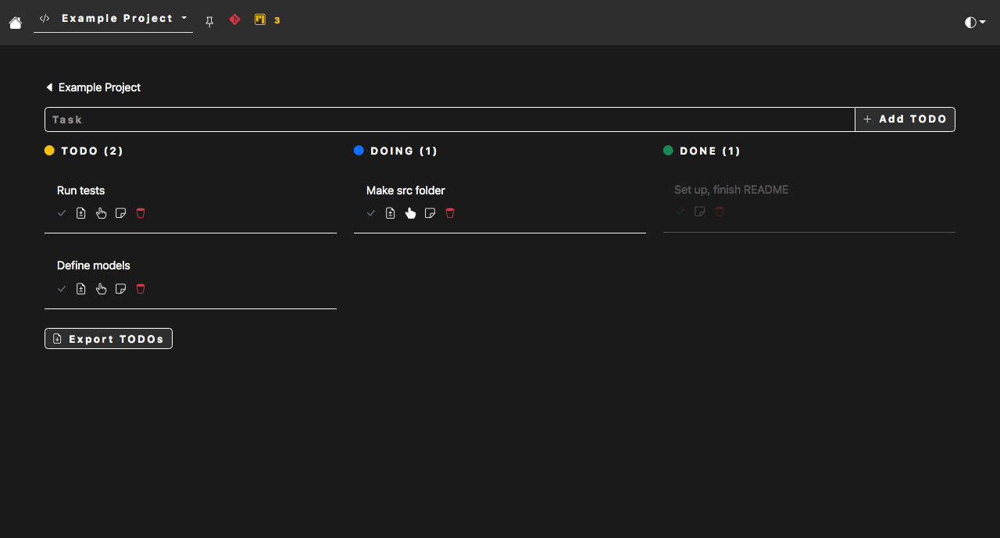
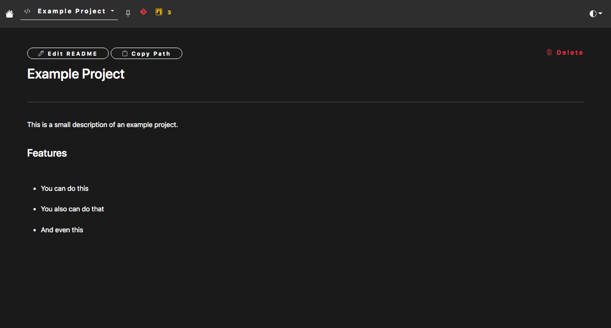

## Git-Some
---
Locally hosted Flask app built to manage GitHub projects and repositories without relying too much on command-line terminals. Inspired by the GitHub Desktop UI

#### Features
- Add your local repositories just by entering its filepath. This information is stored in a **MySQL** database.
- Edit your project's README.md file
- View git information about your repo, such as status, diff, branches, etc.
- Use a Kanban board to list out and manage **TODOs** (tasks) for your project. You can also commit your changes to the repo straight from your Kanban board, saving time on having to write a commit message and description
- Export your TODOs to a `todo.txt` file
- Pin favorites for easy access on the navbar
- Minimalist and responsive interface
- Switch between dark/light themes

#### Usage
Clone this **[GitHub repository](https://github.com/misterrager8/Git-Some).** Set up an `.env` with the only environment variable you need: `db_url`. Then, run the `python3 app.py` command.

#### Screenshots

